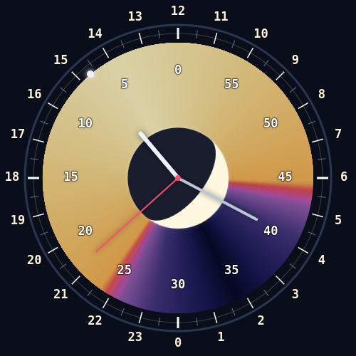
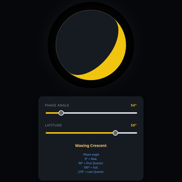
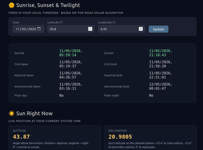

[Nederlands](https://deningenieur.github.io/24-uur-klok/explanation.nl.html) | [English](https://deningenieur.github.io/24-uur-klok/explanation.en.html) | [Français](https://deningenieur.github.io/24-uur-klok/explanation.fr.html) | [Deutsch](https://deningenieur.github.io/24-uur-klok/explanation.de.html) | [Esperanto](https://deningenieur.github.io/24-uur-klok/explanation.eo.html)

  
  
  

